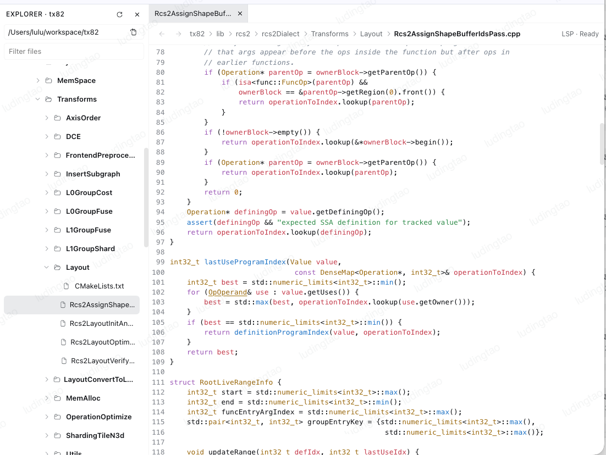
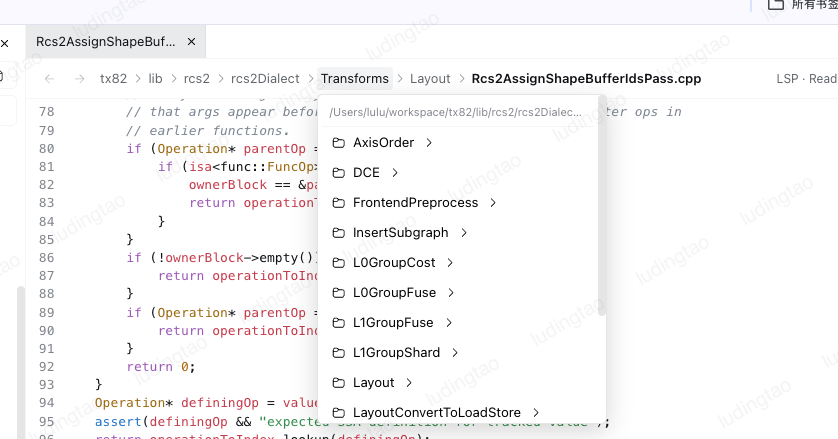
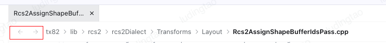
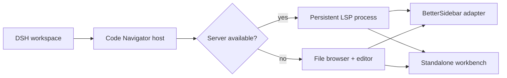

# dsh-code-navigator

[简体中文](README.zh-CN.md) · [Plugin documentation](packages/code-navigator/README.md)

Persistent, VS Code-style source navigation for DeepSeek Harness. The plugin works with BetterSidebar when it is installed and provides its own Explorer, tabs, breadcrumb, editor, and Quick Open workbench when it is not.

> Status: stable `0.1.0` release for DSH `0.1.2-alpha.3+`.

## Prerequisites

The plugin itself works without an external language server. C/C++ definition navigation additionally requires **clangd**, which is not included because it is a native LLVM executable:

```sh
# Check first
clangd --version

# macOS with Homebrew
brew install llvm

# Debian / Ubuntu
sudo apt-get install clangd
```

On Windows, install an official LLVM release and ensure `clangd.exe` is in `PATH`. If Homebrew installs LLVM outside `PATH`, configure `clangdCommand: /opt/homebrew/opt/llvm/bin/clangd` in the plugin settings. See [clangd's official installation guide](https://clangd.llvm.org/installation) for current platform packages and downloads.

Python and JavaScript/TypeScript navigation require no global installation: Pyright, TypeScript Language Server, and TypeScript are included in the npm package.

## Features

| Navigation | Workspace UI | Language services |
| --- | --- | --- |
| Cmd/Ctrl-click definitions | Explorer tree and editable tabs | Persistent clangd for C/C++ |
| Back and forward history | Clickable path breadcrumb | Bundled Pyright for Python |
| Modifier-hover underline | Tab close/context menu | Bundled TypeScript Language Server |
| Cmd/Ctrl+P file search | LSP status and index warm-up | Automatic dependency detection |

## Screenshots

**Standalone workbench — Explorer, tabs, breadcrumb, editor, and LSP status**



**Clickable breadcrumb directory picker**



**Back and forward navigation controls**



## Graceful degradation

Language servers are detected during activation and the result is cached. Missing tools disable only their language feature:

- clangd is optional. Without it, C/C++ files still open with syntax highlighting, but C/C++ indexing and definition lookup stay disabled.
- Pyright, TypeScript Language Server, and TypeScript ship with the plugin. A damaged or incomplete installation disables that server and leaves the workbench usable.
- BetterSidebar is optional. Without it, the standalone workbench is mounted automatically.



## Install a development archive

```sh
pnpm install
pnpm --filter dsh-code-navigator check:release
pnpm --filter dsh-code-navigator pack
dsh plugin --profile web add file:./packages/code-navigator/dsh-code-navigator-0.1.0.tgz
dsh web
```

See the [plugin README](packages/code-navigator/README.md) for configuration, dependency ownership, API integration, and release constraints.

## Repository layout

- `packages/code-navigator/` — independently publishable plugin.
- `packages/better-sidebar/` — upstream-based compatibility fixture; it is not a runtime dependency of the navigator.

The sidebar source tracks [omdsh-dev/DSH-better-sidebar](https://github.com/omdsh-dev/DSH-better-sidebar) through the `upstream` Git remote.

## Development

```sh
pnpm install
pnpm --filter dsh-code-navigator check:release
pnpm peers check
```

Licensed under MIT. See the package's [third-party notices](packages/code-navigator/THIRD_PARTY_NOTICES.md) for bundled runtime components.
