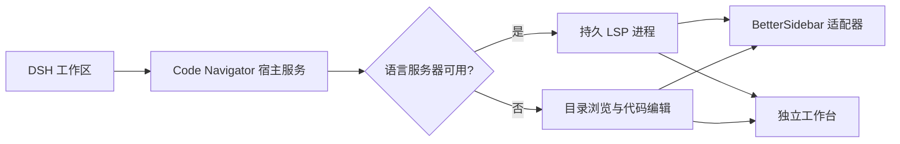

# dsh-code-navigator

[English](README.md) · [插件中文文档](packages/code-navigator/README.zh-CN.md)

为 DeepSeek Harness 提供持久化、接近 VS Code 使用方式的源码导航。安装 BetterSidebar 时插件会通过其扩展接口接入；未安装或关闭 BetterSidebar 时，插件会自动提供独立的目录树、标签页、路径面包屑、代码编辑器和快速文件搜索界面。

> 当前状态：稳定版 `0.1.0`，面向 DSH `0.1.2-alpha.3+`。

## 安装前依赖

插件自身不要求额外安装语言服务器。只有 C/C++ 定义跳转需要额外安装 **clangd**；clangd 是 LLVM 原生程序，因此没有打进 npm 包：

```sh
# 先检查是否已经安装
clangd --version

# macOS（Homebrew）
brew install llvm

# Debian / Ubuntu
sudo apt-get install clangd
```

Windows 可以安装 LLVM 官方发行版，并把 `clangd.exe` 加入 `PATH`。如果 Homebrew 安装的 LLVM 不在 `PATH`，请在插件配置中设置：

```yaml
clangdCommand: /opt/homebrew/opt/llvm/bin/clangd
```

其他系统的安装包与下载方式见 [clangd 官方安装文档](https://clangd.llvm.org/installation)。Python 和 JavaScript/TypeScript 跳转不需要安装全局依赖，Pyright、TypeScript Language Server 和 TypeScript 已包含在插件 npm 包中。

## 功能概览

| 代码导航 | 工作区界面 | 语言服务 |
| --- | --- | --- |
| Cmd/Ctrl 点击跳转定义 | 工作区目录树与文件标签页 | C/C++ 持久 clangd |
| 前进、后退历史 | 可点击的文件路径面包屑 | 插件内置 Python Pyright |
| 按住修饰键显示下划线 | 标签页右键关闭菜单 | 插件内置 TypeScript Language Server |
| Cmd/Ctrl+P 搜索文件 | LSP 状态与索引预热 | 启动时自动探测依赖 |

## 缺少依赖时的行为

插件启动后会探测语言服务器并缓存结果。某项依赖缺失只会关闭对应语言能力，不会导致插件加载失败或界面一直 Pending：

- clangd 是可选系统依赖。没有 clangd 时，C/C++ 文件仍能浏览、编辑和语法高亮，但不会启动 C/C++ 索引和定义跳转。
- Pyright、TypeScript Language Server 和 TypeScript 随插件 npm 包安装。若安装内容损坏或不完整，只关闭相应语言服务，工作区界面仍可使用。
- BetterSidebar 是可选界面适配器。没有 BetterSidebar 时自动启用插件自带工作台。



## 安装开发包

```sh
pnpm install
pnpm --filter dsh-code-navigator check:release
pnpm --filter dsh-code-navigator pack
dsh plugin --profile web add file:./packages/code-navigator/dsh-code-navigator-0.1.0.tgz
dsh web
```

配置项、依赖归属、扩展接口与发布限制请阅读[插件中文文档](packages/code-navigator/README.zh-CN.md)。

## 仓库结构

- `packages/code-navigator/`：可以独立发布的代码导航插件。
- `packages/better-sidebar/`：用于兼容性测试的上游源码副本，不是 Code Navigator 的运行依赖。

Sidebar 源码通过 `upstream` Git remote 跟踪 [omdsh-dev/DSH-better-sidebar](https://github.com/omdsh-dev/DSH-better-sidebar)。

## 开发检查

```sh
pnpm install
pnpm --filter dsh-code-navigator check:release
pnpm peers check
```

项目使用 MIT 许可证。随包组件见[第三方依赖声明](packages/code-navigator/THIRD_PARTY_NOTICES.md)。
